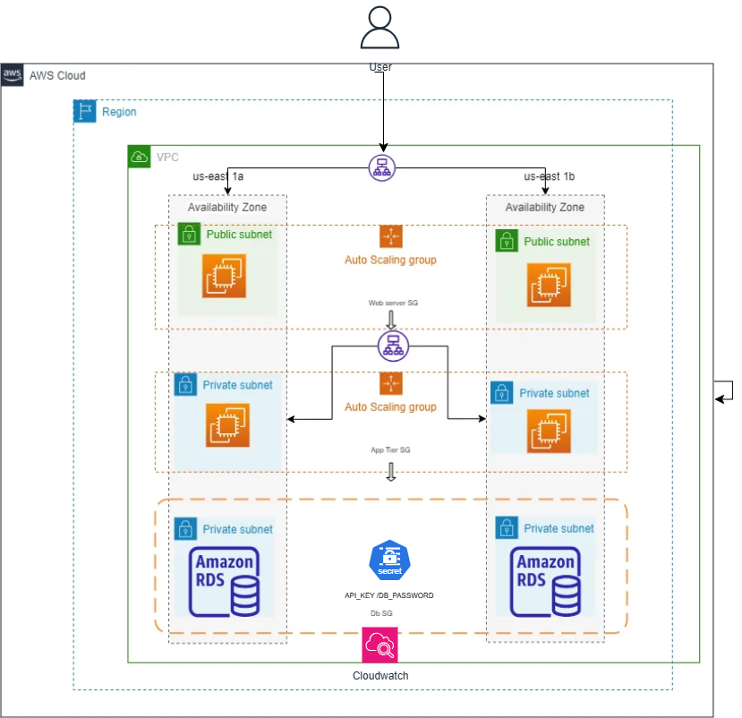

# Senior DevOps Home Assessment

## Overview
This repository contains a secure and scalable infrastructure for a Python Flask web application, deployed on AWS using Terraform, GitHub Actions, and DevOps best practices.

## Setup Instructions
1. **Prerequisites**:
   - AWS CLI configured with appropriate credentials.
   - Terraform installed.
   - GitHub repository with Actions enabled.
   - An S3 bucket for Terraform state (update `ci-cd.yml` with your bucket name).

2. **Infrastructure**:
   - Navigate to `infrastructure/`.
   - Run `terraform init` and `terraform apply` to provision resources.
   - Note the ALB DNS name from outputs.

3. **Application**:
   - The Node.js app is in `app/`.
   - Build and test locally: `docker build -t devops-assessment .` and `npm tests/`.

4. **CI/CD**:
   - Update `ci-cd.yml` with your AWS account ID and Terraform state bucket.
   - Push to the `main` branch to trigger the pipeline.

5. **Access**:
   - Visit the ALB DNS name (e.g., `http://<alb-dns-name>`) to access the app.

## Assumptions
- The application is a simple Node.js Express app requiring a database connection and an API key.
- Public internet access is allowed for the ALB but restricted for EC2 and RDS.
- PostgreSQL is chosen as the data store for its robustness and familiarity.
  
## Known Limitations
- Autoscaling is basic and may need tuning for production workloads.
- No CDN is implemented due to time constraints, but it can be added with CloudFront.
- The monitoring setup is minimal and could be enhanced with custom metrics.
- The ALB can be configured for HTTPS using AWS Certificate Manager (ACM), though a domain is required (not     implemented here but noted in the README).

## Decisions and Trade-offs
- **AWS**: Chosen for familiarity and robust service offerings. Alternatives like GCP or Azure were considered but not used due to time constraints.
- **Terraform**: Preferred for IaC due to its cloud-agnostic nature over AWS CloudFormation.
- **Docker**: Used for consistent deployment; ECS was an alternative but avoided for simplicity.
- **Secrets Manager**: Selected over Parameter Store for its focus on secrets management.
- **Rolling Updates**: Chosen over blue-green deployments to minimize complexity while reducing downtime.

## Directory Structure
- `infrastructure/`: Terraform code.
- `app/`: Flask application and Dockerfile.
- `tests/`: Unit tests.
- `.github/workflows/`: CI/CD pipeline.
